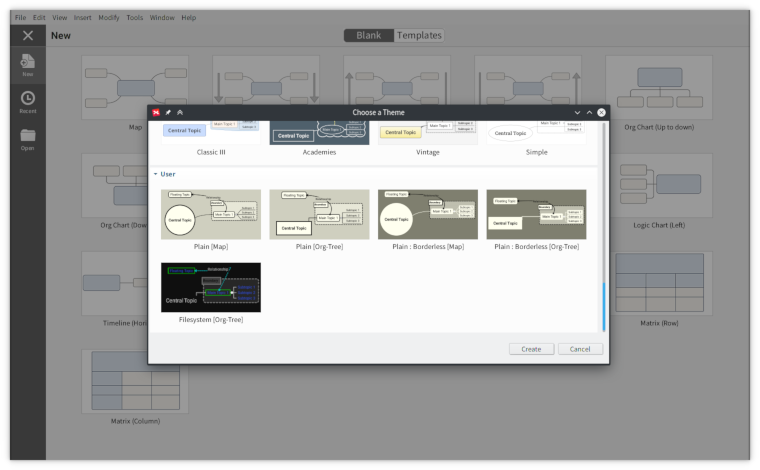

# [XMind](https://github.com/xmindltd/xmind) custom themes and styles

## Themes

> [Map] - Optimized for **Map** and **Ballanced Map** structures
>
> [Org-Tree] - Optimized for **Org Chart** central topic with **Tree Chart** main and sub-topics structures

### Plain [Map]

### Plain [Org-Tree]

### Plain : Borderless [Map]

### Plain : Borderless [Org-Tree]

### Filesystem [Org-Tree]

Includes styles for:

-	Directories (default)
-	Files
-	Mountpoints
	-	Disk
	-	`tmpfs`
	-	System (`/dev`, `/proc`, `/sys`, etc.)
-	Links
	-	Soft
	-	Hard
-	Worktree (`git`, `hg`, `bzr`, etc.)

## Requirements

The themes use the [Roboto](https://github.com/google/roboto) font.

## Installation

Install into a pre-existing `workspace/styles/` directory.
